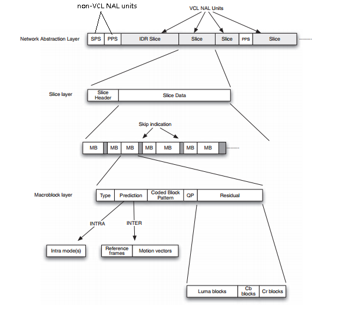

  
###SPS(Sequence Parameter Sets)

###PPS(Picture Parameter Sets)
###IDR(Instantaneous Decoder Refresh)
IDR帧是I帧的一种，解码过程中遇到IDR帧，会刷新当前的SPS和PPS
###QP(Quantization Parameter)

###Slice 条带
多个宏块组成一个条带，多个条带组成一帧图像。

Slice Type|Description|Profile
----|---- | ----
I|仅包含I宏块|All
P|包含P宏块和I宏块|All
B|包含B宏块和B宏块|Extended and Main
SP| |Extended
SI|仅包含SI宏块|Extended

###MB 宏块


###NAL(Network Abstration Layer)
编码后的视频数据是组织成一个个nal单元的，nal单元的第一个（或第一二个）字节描述了该单元的类型（具体参考NAL头部）

#####VCL(Video Coding Layer)
 nal单元可以分类为vcl和非vcl单元。vcl nal单元包含了图像帧的数据，非vcl nal单元包含了一些格外的信息，如参数集，时间等

#####NAL头部
```
+---------------+
|0|1|2|3|4|5|6|7|
+-+-+-+-+-+-+-+-+
|F|NRI|  Type   |
+---------------+

F(forbidden_ zero_bit)：在h.264中为0
NRI(nal_ ref_idc)：0表示该单位不会作为参考帧数据，非0值相反
Type：
```