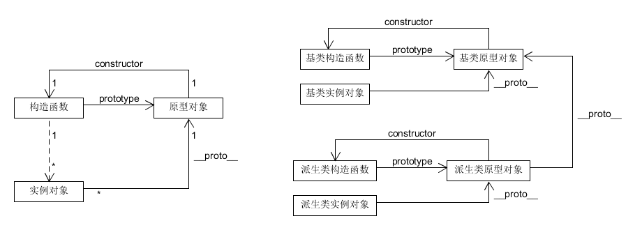

##工厂模式

```
function createPerson(name, age, job) {
	var o = new Object();
	o.name = name;
	o.age = age;
	o.job = job;
	o.sayName = function() {
		console.log(this.name);
	}
	return o;
}
```
- 缺点：没有解决对象识别的问题

##构造函数模式

```
function Person(name, age, job) {
	this.name = name;
	this.age = age;
	this.job = job;
	this.sayName = function() {
		console.log(this.name);
	}
}

var person = new Person("Nicholas", 29, "Software Engineer")

console.log(person instanceof Person) //true
```
- 缺点：每个方法都要在每个实例上重新创建一遍

##原型模式 + 构造函数模式



```
function Person(name, age ,job) {
	this.name = name;
	this.age = age;
	this.job = job;
}

Person.prototype.sayName = function() {
	
}
```
- 类似lua的元表