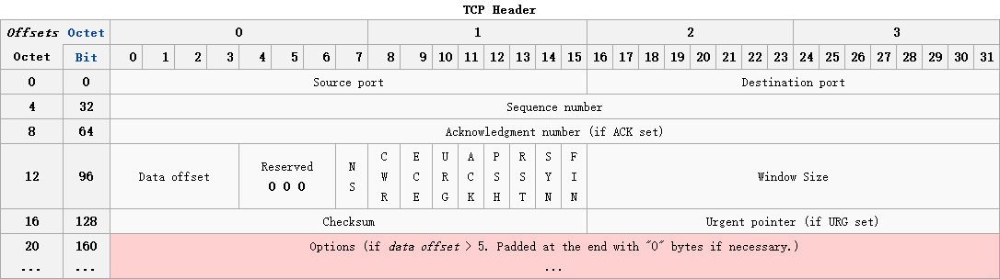

<!---->
- Source port (16 bits)
 + 源端口号
- Destination port (16 bits)
 + 目标端口号
- Sequence number (32 bits)
 + 序列号
- Acknowledgment number (32 bits)
 + 确认号
- Data offset (4 bits) 
 + TC头部大小，取决于Options部分的大小，范围在20~60bytes
- Reserved (3 bits)
 + 保留位
- Flags (9 bits) (aka Control bits)
 + NS：
 + CWR（Congestion Window Reduced)：
 + ECE：
 + URG：
 + ACK：
 + PSH：
 + RST：
 + SYN：
 + FIN：